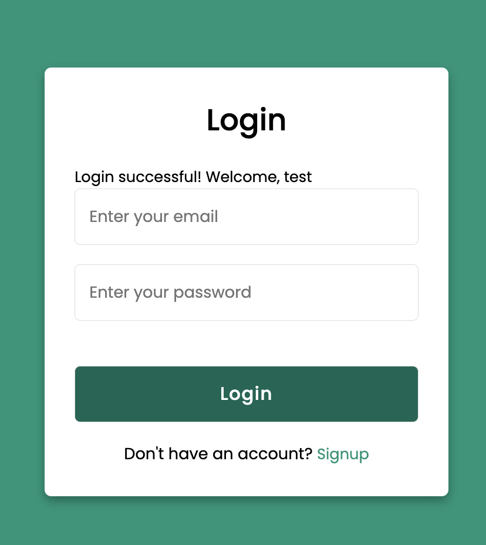

# VMD_Assignment1

## About
Python Server using Flask with basic Login and Registration Pages.

### How to Build
- Checkout GitHub Library
-  Create the docker file using command
`docker build -t vm.assignment:v1`

- Run the docker file using command
`docker run -p 5001:5001 vm.assignment:v1`

### Notes:
Login Page: http://localhost:5001/login
Registration Page: http://localhost:5001/login

### UI Images:
- Basic UI Page
  

- Wrong credentials
  

- Registration Page
  

- Registration Successful
  

- Login Successful
  

